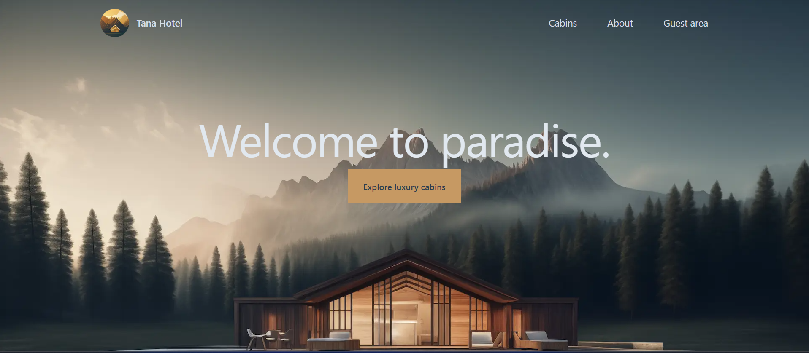
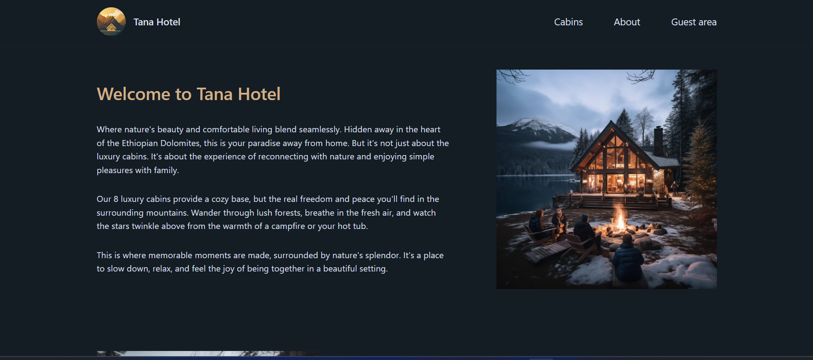
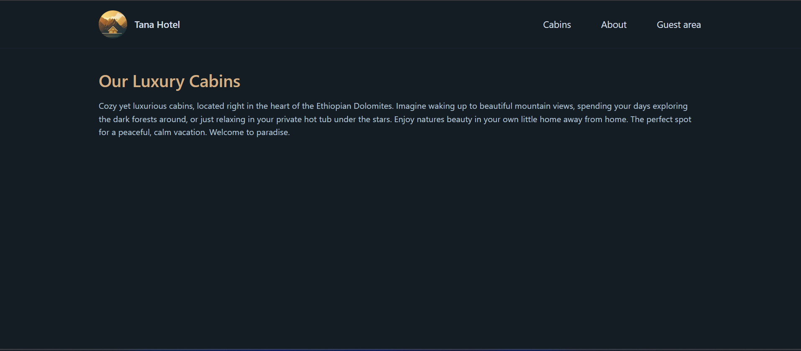
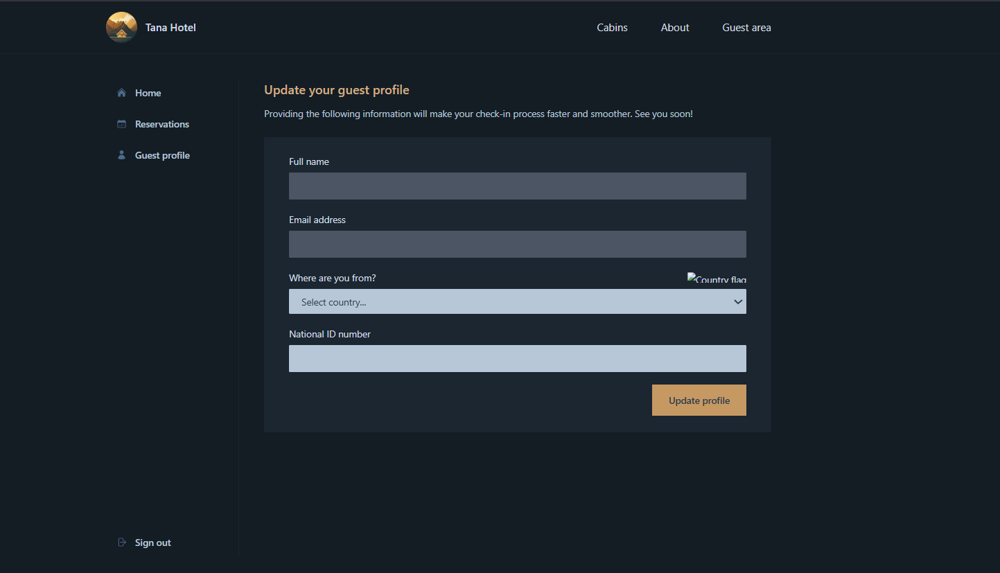

# 🏨 Tana Hotel - Cabin Booking Website (WIP)

**Tana Hotel** is a modern, customer-facing cabin booking platform built with **Next.js**. The project is currently under development, focusing on delivering a smooth user experience for viewing and reserving cabins.

---

## ⚙️ Current Progress

- ✅ Project setup with Next.js App Router
- ✅ Static routing for:
  - `/` (Home)
  - `/about`
  - `/cabins`
  - `/account/profile`
  - `/account/reservations`
- ✅ Image & font optimization
- ✅ Metadata & favicon setup
- 🚧 Booking functionality (in progress)
- 🚧 Backend integration (coming soon)

## 🖼️ Screenshots

### 🏠 Home Page

### ℹ️ About Page

### 🛏️ Cabins Page

### 👤 Profile Page

